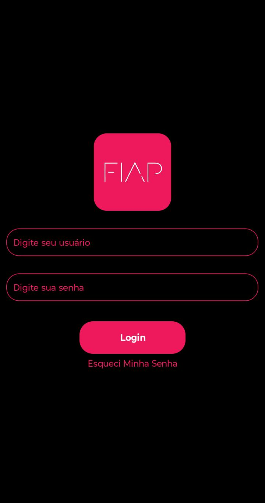

# Checkpoint 1 -Tela de Login App Fiap
> **Professor:** Adeilton Meneses \
> **Disciplina:** Mobile Development e IoT

---

## Descrição do Projeto
Aplicativo mobile desenvolvido em **React Native com Expo**, com o objetivo de criar a **tela de Login** do APP FIAP. 
O projeto aplica os conceitos de componentização, estilização com **NativeWind** (Tailwind CSS para React Native) 
e boas práticas de estrutura de projeto.

### Ideia Principal
Desenvolver uma tela de login funcional e visualmente alinhada à identidade da FIAP, com os componentes base exigidos 
pela disciplina (texto, input, botão, imagem), seguindo o padrão de projeto definido em aula.

### Requisitos 
- [x] Exibição do logotipo da FIAP
- [x] Campo de entrada para usuário (TextInput)
- [x] Campo de entrada para senha (TextInput com `secureTextEntry`)
- [x] Botão de Login (TouchableOpacity)
- [x] Link "Esqueci Minha Senha" (TouchableWithoutFeedback)
- [x] Componentes personalizados e reutilizáveis
- [x] Estilização com **NativeWind** (classes Tailwind)
- [x] Layout centralizado com fundo preto e identidade visual FIAP (rosa `#ed195c`)

---

## Componentes Criados
| Componente | Descrição |
|---|---|
| `ScreenContent` | Componente principal que organiza o layout da tela de login |
| `ImageComponent` | Exibe o logotipo da FIAP |
| `InputComponent` | Campo de texto reutilizável com suporte a tipo `text` ou `senha` |
| `ButtonLoginComponent` | Botão estilizado para ação de login |
| `ForgotPasswordComponent` | Link/texto clicável de "Esqueci Minha Senha" |

---

## Tecnologias Utilizadas
- [React Native](https://reactnative.dev/)
- [Expo](https://expo.dev/) `^54.0.0`
- [NativeWind](https://www.nativewind.dev/) (Tailwind CSS para React Native)
- [TypeScript](https://www.typescriptlang.org/)
- [react-native-safe-area-context](https://docs.expo.dev/versions/latest/sdk/safe-area-context/)

---

## Como Executar o Projeto
### Pré-requisitos
- Node.js instalado
- Expo CLI instalado (`npm install -g expo-cli`)
- Aplicativo **Expo Go** no celular (iOS ou Android)

### Passos 
```bash
# 1. Clone o repositório
git clone https://github.com/seu-usuario/Checkpoint1-Mobile-Devlopment.git
 
# 2. Entre na pasta do projeto
cd Checkpoint1-Mobile-Devlopment
 
# 3. Instale as dependências
npm install
 
# 4. Inicie o projeto
npm start
```
 
Escaneie o QR Code exibido no terminal com o aplicativo **Expo Go** para visualizar no dispositivo.

---

## Estrutura do Projeto 
```
Checkpoint1-Mobile-Devlopment/
├── assets/
│   ├── fiap-logo.png
│   └── ...
├── components/
│   ├── ButtonLoginComponent.tsx
│   ├── ForgotPasswordComponent.tsx
│   ├── ImageComponent.tsx
│   ├── InputComponent.tsx
│   └── ScreenContent.tsx
├── App.tsx
├── global.css
├── tailwind.config.js
├── babel.config.js
└── package.json
```

---

## Equipe 
| Nome | RM |
|---|---|
| João Pedro Signor Avelar | RM 558375 |
| Roger Cardoso Ferreira | RM 557230 |
| _(nome do integrante 3)_ | RM XXXXX |

---

## Print da Tela Desenvolvida
<!-- Exemplo:

-->
